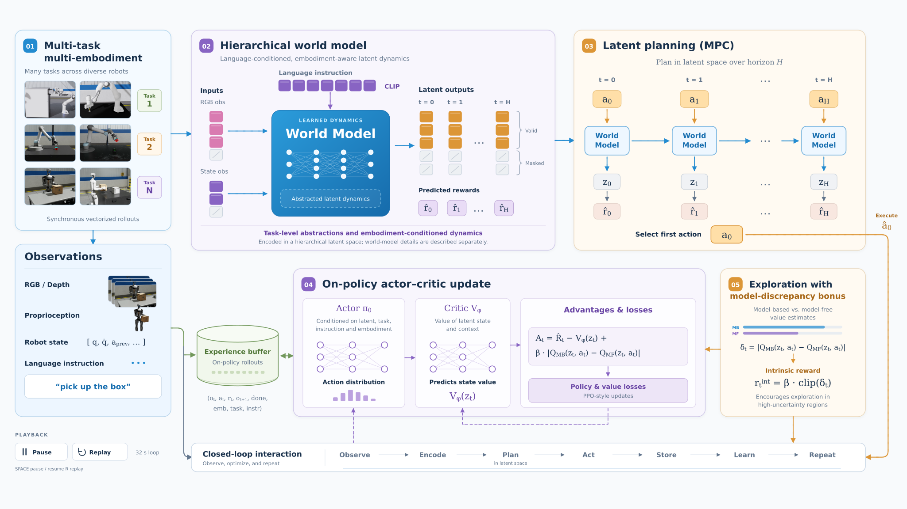
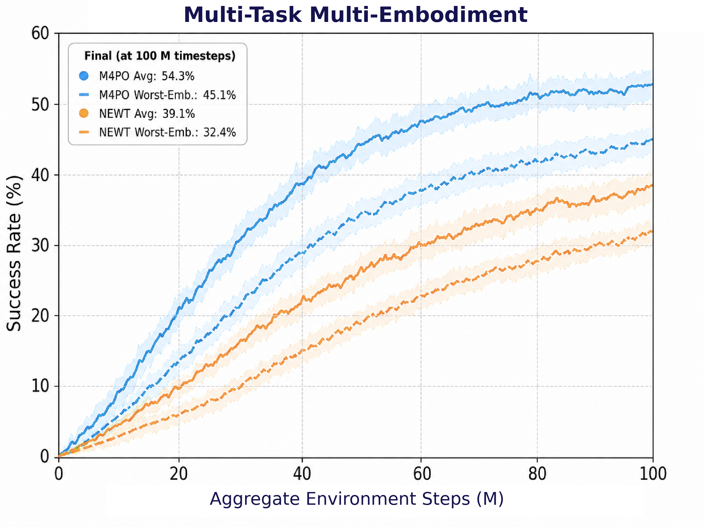
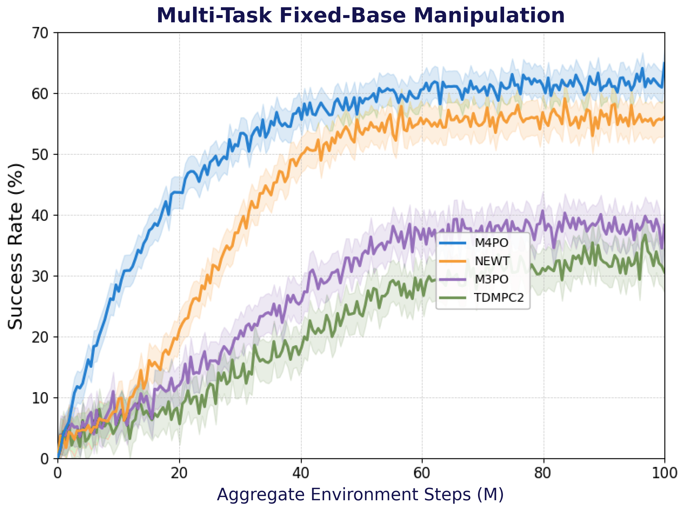
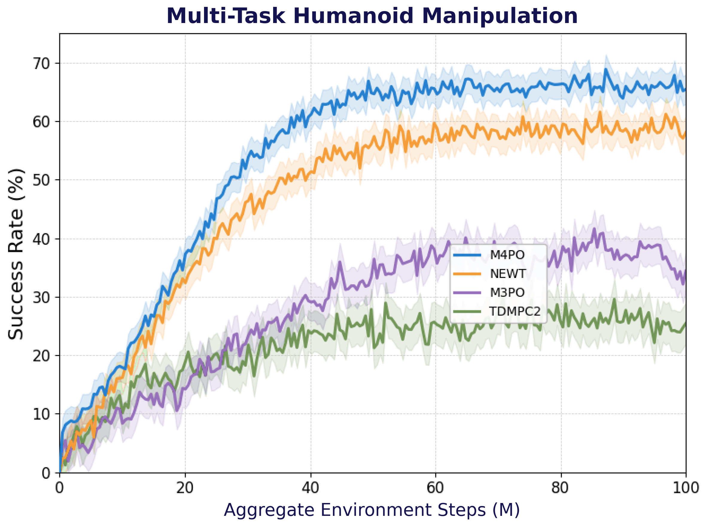
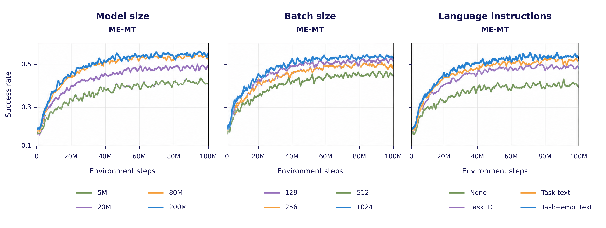
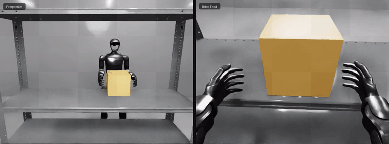
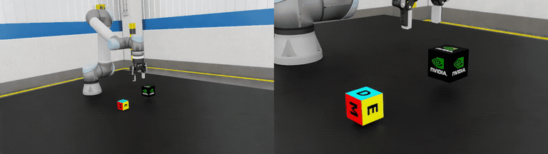
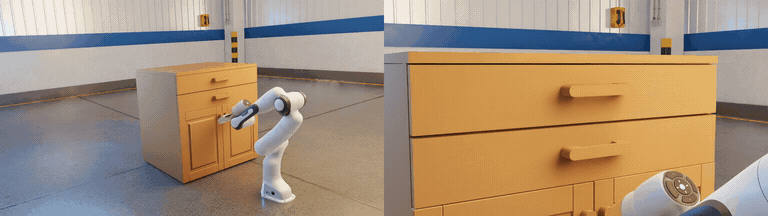

# M4PO

**Massively Multi-Task Multi-Embodiment Model-Based Policy Optimization**

[Paper](docs/M4PO_CoRL_26-1.pdf) · [Results](#paper-results) · [Supplementary videos](#supplementary-videos)

M4PO studies how one manipulation policy can share knowledge across tasks and
robot embodiments while respecting their different dynamics and action spaces.
It combines a hierarchical world model with stochastic planning in latent space
and an embodiment-masked continuous action interface.

## Method

- **Multimodal conditioning.** RGB-D, proprioception, structured state, task
  language, and embodiment context provide a shared observation interface.
- **Task–embodiment hierarchy.** Separate latent components represent task
  progress and embodiment state. The predicted embodiment transition conditions
  the next task-level prediction.
- **Shared continuous actions.** Normalized controls are padded to a common
  dimension, with invalid coordinates masked during prediction, planning,
  policy likelihood computation, and execution.
- **Stochastic latent planning.** MPPI evaluates candidate action sequences in
  the learned world model and forms the distribution used to select controls.
- **Paper learning objective.** Fresh rollouts train the world model and
  planner-policy; a model-based/model-free value-discrepancy bonus supports
  exploration.

The paper evaluates fixed-base, dexterous, and humanoid manipulation, including
grasping, object relocation, articulated manipulation, precision assembly, and
multi-object manipulation.

## Paper results

The following results are reported in the [M4PO paper](docs/M4PO_CoRL_26-1.pdf).
The paper reports three seeds and 100 evaluation episodes per task–embodiment
pair for simulation.
Its IsaacLab manipulation benchmarks are distinct from NEWT's 200-task MMBench.

### Multi-embodiment, multi-task manipulation

One policy is shared across tasks and embodiments. The manuscript reports
**54.3% average success** and **45.1% worst-embodiment success**, improvements of
15.2 and 12.7 percentage points over its NEWT baseline.

| Metric | NEWT | M4PO |
| --- | ---: | ---: |
| Average success (%) ↑ | 39.1 | **54.3** |
| Worst-embodiment success (%) ↑ | 32.4 | **45.1** |
| Average return ↑ | 0.46 | **0.62** |
| AUC ↑ | 0.26 | **0.37** |

Source: manuscript Table V. AUC integrates success over normalized aggregate
environment steps.

*Supplied manuscript figure. Solid curves show average success; dashed curves
show worst-embodiment success.*

### Multi-task learning within each paradigm

Each policy covers multiple tasks within one manipulation paradigm.

| Method | Dexterous success (%) | Fixed-base success (%) | Humanoid success (%) | Average (%) |
| --- | ---: | ---: | ---: | ---: |
| TD-MPC2 | 25.4 | 32.5 | 25.0 | 27.6 |
| M3PO | 30.2 | 38.5 | 36.0 | 34.9 |
| NEWT | 50.2 | 56.0 | 59.0 | 55.1 |
| M4PO | **55.3** | **62.0** | **66.2** | **61.2** |

Source: manuscript Table IV.

| Fixed-base manipulation | Humanoid manipulation |
| --- | --- |
|  |  |

### Expanded IsaacLab-Arena

| Method | Average success (%) | Worst-embodiment success (%) |
| --- | ---: | ---: |
| NEWT | 36.4 | 23.7 |
| M4PO | **50.8** | **37.2** |

Source: manuscript Table VI.

Model scale, batch size, and language conditioning

The supplied figure compares model scale, batch size, and instruction
conditioning in the multi-embodiment multi-task setting.

### Hardware evaluation

The manuscript reports **85 successes in 100 trials** across five conditions.
Policy parameters remain fixed during hardware evaluation; G1-specific
adaptation takes place beforehand in simulation.

| Robot | Condition | Successful trials |
| --- | --- | ---: |
| Unitree G1 | Box lifting without image observations | 18 / 20 |
| Franka | Fruit picking | 19 / 20 |
| Franka | Fruit sorting | 15 / 20 |
| Franka | Cube on cylinder | 17 / 20 |
| Franka | Cylinder on cube | 16 / 20 |
| **Total** | | **85 / 100** |

Source: manuscript Table VIII. Fruit sorting tests a task composition excluded
from simulation training.

## Supplementary videos

Animated simulation demonstrations spanning humanoid and arm manipulation.
The GIFs loop inline; select one to open the full video. UR5 and Franka previews
show an eight-second excerpt, while the G1 preview shows the complete clip.

| Unitree G1 · lifting | UR5 · stacking | Franka · cabinet manipulation |
| --- | --- | --- |
|  |  |  |

## Repository scope

This repository includes the hierarchical world model, masked action interface,
stochastic planner, task–embodiment evaluation, and integrations for IsaacLab
and MMBench.

The paper figures and supplementary videos are preserved separately from
training artifacts. [Result and media provenance](docs/PAPER_RESULTS.md)
records their sources and the known differences between manuscript versions.

## License

The repository code is available under the [MIT license](LICENSE).
